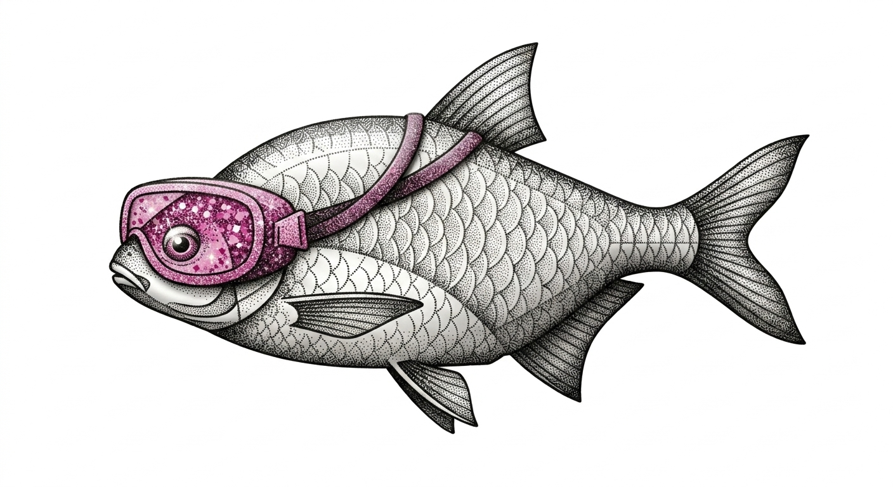
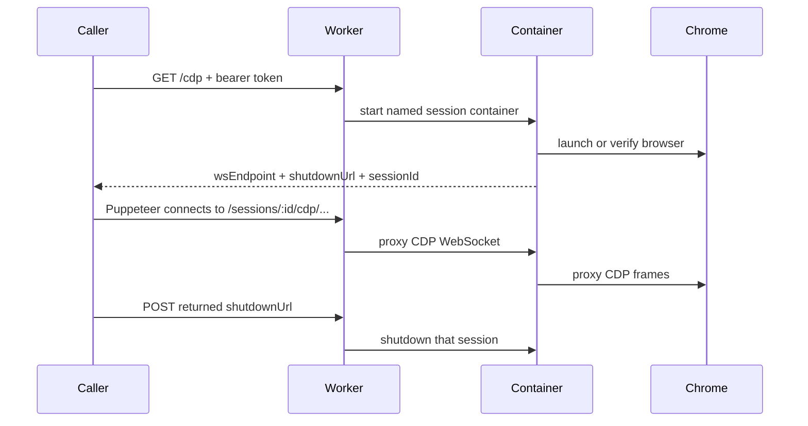

<p align="center">
  
</p>

# breamer

Fresh Google Chrome Stable containers on Cloudflare, exposed as long-lived Puppeteer-compatible CDP sessions.

Breamer gives you a self-contained browser environment for remote automation. Send one authenticated request to the Worker, get back a WebSocket endpoint, connect with Puppeteer, then call the returned shutdown URL when the job is finished.

<p align="center">
  <a href="https://deploy.workers.cloudflare.com/?url=https%3A%2F%2Fgithub.com%2Fkenobi-ai%2Fbreamer">
    
  </a>
</p>

No shared singleton browser. No public root page. No global shutdown button. Each authorized `/cdp` request gets its own named Cloudflare Container session.

## What It Ships

- A Cloudflare Worker that authenticates session creation.
- A Cloudflare Container running Bun, Hono, Puppeteer, and official Google Chrome Stable.
- A session-scoped CDP proxy, so Puppeteer connects through the Worker URL.
- A returned shutdown URL for that one browser session.
- A 5 minute container sleep horizon for jobs that fail to clean up.
- `standard-4` container sizing, configured Chrome heap/window settings, Mac Chrome-like page defaults, SwiftShader/ANGLE software graphics, a curated desktop/web font base, browser font aliases, and structured browser lifecycle logs.
- CDP-level pre-capture settling for `Page.captureSnapshot`, so MHTML archives wait briefly for DOM readiness, fonts, image decodes, idle time, dynamic media rasterization, and compositor frames before capture.
- Structured request, session, browser, CDP proxy, auth, health, and shutdown logs across Worker and container.

## Flow



## Local Parity

Local development uses Wrangler plus the same Dockerfile Cloudflare deploys.

```bash
bun install
cp .dev.vars.example .dev.vars
bun run dev
```

Wrangler usually serves the Worker at `http://localhost:8787`.

Fetch a browser session:

```bash
curl -H "Authorization: Bearer dev-secret" http://localhost:8787/cdp
```

Response:

```json
{
  "wsEndpoint": "ws://localhost:8787/sessions/00382bb3-25dd-433c-bce4-495dd0438ea2/cdp/devtools/browser/96a96c29-36ad-47da-be46-35249f44dc66",
  "shutdownUrl": "http://localhost:8787/sessions/00382bb3-25dd-433c-bce4-495dd0438ea2/shutdown",
  "sessionId": "00382bb3-25dd-433c-bce4-495dd0438ea2",
  "mode": "proxy",
  "path": "/sessions/00382bb3-25dd-433c-bce4-495dd0438ea2/cdp/devtools/browser/96a96c29-36ad-47da-be46-35249f44dc66",
  "localPath": "/devtools/browser/96a96c29-36ad-47da-be46-35249f44dc66"
}
```

Connect from Puppeteer:

```ts
import puppeteer from "puppeteer";

const response = await fetch(`${process.env.BREAMER_ROOT_URL}/cdp`, {
  headers: {
    Authorization: `Bearer ${process.env.BREAMER_ACCESS_TOKEN}`
  }
});

if (!response.ok) {
  throw new Error(await response.text());
}

const { wsEndpoint, shutdownUrl } = await response.json() as {
  wsEndpoint: string;
  shutdownUrl: string;
};

const browser = await puppeteer.connect({
  browserWSEndpoint: wsEndpoint,
  defaultViewport: null
});

try {
  const page = await browser.newPage();
  await page.goto("https://example.com", { waitUntil: "networkidle0" });
} finally {
  browser.disconnect();
  await fetch(shutdownUrl, { method: "POST" });
}
```

Capture an MHTML archive through the live CDP service:

```bash
bun run capture:mhtml -- --live-url https://example.com --token "$BREAMER_ACCESS_TOKEN"
```

By default this calls `https://breamer.kenobi.ai/cdp` and writes the archive
under `mhtml-archives/`. It also prints the live browser fingerprint used for the capture, including user agent, client hints, locale, timezone, viewport, screen, and media-query values. To point at another Breamer root URL:

```bash
bun run capture:mhtml -- https://breamer.example.com "$BREAMER_ACCESS_TOKEN" https://example.com
```

Useful knobs:

```bash
bun run capture:mhtml -- \
  --service-url https://breamer.example.com \
  --token "$BREAMER_ACCESS_TOKEN" \
  --url https://example.com \
  --wait-for-selector main \
  --viewport 1440x900 \
  --out-dir mhtml-archives
```

Compare Breamer against an already-running local Mac Chrome:

```bash
bun run compare:rendering -- \
  --service-url https://breamer.example.com \
  --token "$BREAMER_ACCESS_TOKEN" \
  --url https://example.com \
  --reference-http http://127.0.0.1:9222
```

Start your reference Chrome yourself with remote debugging enabled, then pass either
`--reference-http` or `--reference-ws`. The helper writes paired PNG screenshots and
a JSON report under `render-comparisons/`, including pixel-diff metrics and browser
fingerprint differences. It never launches the reference browser for you.

Do not use Wrangler's temporary `*.trycloudflare.com` tunnel as the CDP parity test. It is fine for HTTP checks, but WebSocket upgrade behavior can differ. Use `http://localhost:8787` locally and a real deployed Worker URL publicly.

## Deploy

Set the Worker secret:

```bash
bunx wrangler secret put BREAMER_ACCESS_TOKEN
```

Deploy:

```bash
bun run deploy
```

Dry run the Worker and container build:

```bash
bun run dry-run
```

`wrangler.jsonc` pins this project to Cloudflare account `6f735f3e89aec8751cf8ad7ed37cae12` and custom domain `breamer.kenobi.ai`.

## API

| Endpoint | Auth | Description |
| --- | --- | --- |
| `GET /cdp` or `POST /cdp` | Bearer token | Creates a fresh named container session and returns `wsEndpoint`, `shutdownUrl`, and `sessionId`. |
| `GET /sessions/:sessionId/cdp/...` | Session URL possession | CDP WebSocket route used by Puppeteer. |
| `POST /sessions/:sessionId/shutdown` | Session URL possession | Stops that specific browser container. |
| `GET /health` or `GET /_worker/health` | Bearer token | Worker health/config check. Does not wake a container. |
| `GET /sessions/:sessionId/health` | Bearer token | Container health check. |
| `GET /sessions/:sessionId/ready` | Bearer token | Verifies Chrome is ready inside that session. |

`/` intentionally returns `404`.

## Configuration

Non-secret settings live in `wrangler.jsonc`.

| Setting | Default | Purpose |
| --- | --- | --- |
| `BREAMER_PAGE_TIMEOUT_MS` | Required | Idle page cleanup inside the container. |
| `BREAMER_CHROME_HEAP_SIZE_MB` | Required | Chrome V8 heap size. |
| `BREAMER_BROWSER_WIDTH` | Required | Initial browser width. |
| `BREAMER_BROWSER_HEIGHT` | Required | Initial browser height. |
| `BREAMER_BROWSER_DEVICE_SCALE_FACTOR` | Required | Initial device scale factor. |
| `BREAMER_BROWSER_LOCALE` | Required | Chrome locale. |
| `BREAMER_BROWSER_USER_AGENT` | unset | Optional user agent override. |
| `BREAMER_BROWSER_PLATFORM` | Required | JavaScript navigator platform override. |
| `BREAMER_BROWSER_CLIENT_HINT_PLATFORM` | Required | User-Agent Client Hints platform. |
| `BREAMER_BROWSER_CLIENT_HINT_ARCHITECTURE` | Required | User-Agent Client Hints architecture. |
| `BREAMER_BROWSER_CLIENT_HINT_PLATFORM_VERSION` | Required | User-Agent Client Hints platform version. |
| `BREAMER_BROWSER_COLOR_GAMUT` | Required | Emulated CSS color gamut. |
| `BREAMER_BROWSER_HARDWARE_CONCURRENCY` | Required | JavaScript navigator CPU thread count override. |
| `BREAMER_BROWSER_DEVICE_MEMORY_GB` | Required | JavaScript navigator memory bucket override. |
| `BREAMER_BROWSER_PREFERS_COLOR_SCHEME` | Required | Emulated `prefers-color-scheme`. |
| `BREAMER_BROWSER_PREFERS_REDUCED_MOTION` | Required | Emulated `prefers-reduced-motion`. |
| `BREAMER_BROWSER_TIMEZONE` | Required | Emulated browser timezone. |
| `BREAMER_ARCHIVE_SETTLE_BEFORE_CAPTURE` | Required | Enables CDP proxy settling before `Page.captureSnapshot`. |
| `BREAMER_ARCHIVE_AUTO_SCROLL_BEFORE_CAPTURE` | Required | Scrolls through the page briefly before MHTML capture to trigger lazy-loaded content, then restores the scroll position. |
| `BREAMER_ARCHIVE_SETTLE_TIMEOUT_MS` | Required | Maximum pre-capture wait for fonts, images, idle time, and compositor frames. |
| `BREAMER_ARCHIVE_RASTERIZE_DYNAMIC_MEDIA` | Required | Replaces readable canvas/video elements with PNG snapshots immediately before MHTML capture. |
| `BREAMER_SLEEP_AFTER` | `5m` | Cloudflare Container sleep horizon. |

Secret:

```bash
BREAMER_ACCESS_TOKEN=<long random token>
```

Shutdown URLs do not require the bearer token. They are high-entropy session capabilities returned only from an authorized `/cdp` call.

## Logging

Worker logs are structured JSON with `requestId`, route, status, duration, session ID, and container lifecycle events.

Container logs include:

- boot configuration
- request method/path/status/duration
- auth failures
- session ID and request ID
- browser launch and disconnects
- target/page lifecycle
- console errors and page errors
- CDP proxy connect/open/close/error
- endpoint issuance
- readiness, health, and shutdown

The Worker forwards `x-breamer-request-id` into the container, so a single job can be followed across both layers.

## Archive Quality Notes

Breamer starts a Mac Chrome-like default browser: high-DPI desktop viewport, macOS user agent and client hints, Chrome-shaped `Accept-Language`, `Europe/London` timezone, `MacIntel` navigator platform, desktop hardware/memory buckets, P3 color-gamut media, light color scheme, normal motion preference, screen media, active/focused page state, and no-touch desktop metrics. Callers can still override these per page.

Breamer automatically settles pages before proxied `Page.captureSnapshot` calls. The settle step waits for DOM readiness, `document.fonts.ready`, pending image decodes, CSS image URLs, pseudo-element images, mask images, idle time, and a few compositor frames. It briefly scrolls through the page to trigger lazy-loaded content, traverses open shadow roots for images and dynamic media, then restores the scroll position. It also replaces readable canvas elements and current video frames with PNG images so MHTML archives do not lose dynamic pixels. If the settle step fails or times out, capture still proceeds and the event is logged.

The container image runs official Google Chrome Stable, includes Mesa/Vulkan/GL libraries for Chrome's software graphics path, and installs a curated high-coverage font base instead of vendoring Google Fonts or every Debian `fonts-*` package. The font set keeps metric-compatible Office/core web fonts, Noto core/CJK/emoji coverage, common UI fonts, code fonts, Material Icons, and Font Awesome. Fontconfig aliases map common proprietary stacks such as Arial, Helvetica, Times New Roman, Courier New, Georgia, Verdana, Tahoma, Consolas, Calibri, Cambria, Segoe UI, SF Pro, Material Icons, Font Awesome, and Apple/Segoe emoji to available metric-compatible fonts.

Callers still own page-specific capture correctness. Before `Page.captureSnapshot`, set any target-specific viewport, user agent, locale/media, and wait policy your archive needs.

For MHTML capture, a good caller sequence is:

1. Connect with `defaultViewport: null`.
2. Create a page and set the viewport you want.
3. Set user agent and extra headers if the target site is sensitive to them.
4. Navigate with a settled wait strategy.
5. Wait for app-specific async work that only the caller understands.
6. Capture MHTML.
7. Call the returned shutdown URL.

For visual parity work, use `bun run compare:rendering` against a real local Mac Chrome
remote-debugging endpoint. The screenshot diff will not explain every browser-layout
choice, but it gives a tight loop for finding concrete remaining gaps instead of
judging archives by eye.

## Docker

Wrangler builds this image automatically:

```bash
docker build -t breamer .
```

If you run the raw container directly, pass the same required container env vars the Worker injects: `PAGE_TIMEOUT_MS`, `CHROME_HEAP_SIZE_MB`, `BROWSER_WIDTH`, `BROWSER_HEIGHT`, `BROWSER_DEVICE_SCALE_FACTOR`, `BROWSER_LOCALE`, `BROWSER_PLATFORM`, `BROWSER_CLIENT_HINT_PLATFORM`, `BROWSER_CLIENT_HINT_ARCHITECTURE`, `BROWSER_CLIENT_HINT_PLATFORM_VERSION`, `BROWSER_COLOR_GAMUT`, `BROWSER_HARDWARE_CONCURRENCY`, `BROWSER_DEVICE_MEMORY_GB`, `BROWSER_PREFERS_COLOR_SCHEME`, `BROWSER_PREFERS_REDUCED_MOTION`, `BROWSER_TIMEZONE`, `ARCHIVE_SETTLE_BEFORE_CAPTURE`, `ARCHIVE_AUTO_SCROLL_BEFORE_CAPTURE`, `ARCHIVE_SETTLE_TIMEOUT_MS`, and `ARCHIVE_RASTERIZE_DYNAMIC_MEDIA`.

## Checks

```bash
bun run check
```

`check` regenerates Wrangler Worker types, typechecks the Worker and Bun container code, runs tests, checks formatting/linting with Biome, checks unused files/dependencies with Knip, and runs the repo-local pokayoke policy so the service stays private Cloudflare infrastructure.

There is no separate application build step. Wrangler compiles the Worker for dev/deploy, and the container image runs `src/server.ts` directly on Bun.

## License

MIT
