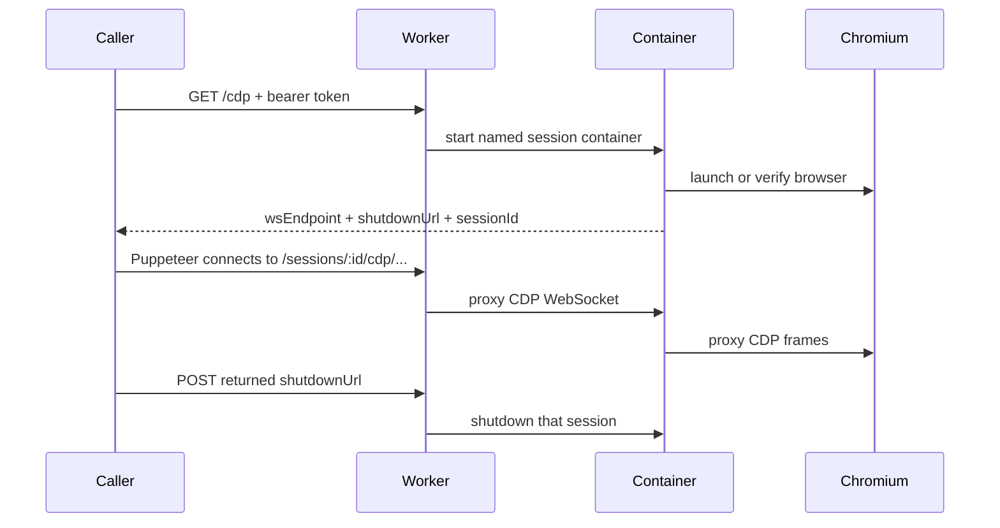

<p align="center">
  
</p>

# breamer

Fresh Chromium containers on Cloudflare, exposed as long-lived Puppeteer-compatible CDP sessions.

Breamer gives you a self-contained browser environment for remote automation. Send one authenticated request to the Worker, get back a WebSocket endpoint, connect with Puppeteer, then call the returned shutdown URL when the job is finished.

<p align="center">
  <a href="https://deploy.workers.cloudflare.com/?url=https%3A%2F%2Fgithub.com%2Fkenobi-ai%2Fbreamer">
    
  </a>
</p>

No shared singleton browser. No public root page. No global shutdown button. Each authorized `/cdp` request gets its own named Cloudflare Container session.

## What It Ships

- A Cloudflare Worker that authenticates session creation.
- A Cloudflare Container running Bun, Hono, Puppeteer, and system Chromium.
- A session-scoped CDP proxy, so Puppeteer connects through the Worker URL.
- A returned shutdown URL for that one browser session.
- A 5 minute container sleep horizon for jobs that fail to clean up.
- `standard-4` container sizing, configured Chromium heap/window settings, broad Linux font coverage, and structured browser lifecycle logs.
- Structured request, session, browser, CDP proxy, auth, health, and shutdown logs across Worker and container.

## Flow



## Local Parity

Local development uses Wrangler plus the same Dockerfile Cloudflare deploys.

```bash
bun install
cp .dev.vars.example .dev.vars
bun run dev
```

Wrangler usually serves the Worker at `http://localhost:8787`.

Fetch a browser session:

```bash
curl -H "Authorization: Bearer dev-secret" http://localhost:8787/cdp
```

Response:

```json
{
  "wsEndpoint": "ws://localhost:8787/sessions/00382bb3-25dd-433c-bce4-495dd0438ea2/cdp/devtools/browser/96a96c29-36ad-47da-be46-35249f44dc66",
  "shutdownUrl": "http://localhost:8787/sessions/00382bb3-25dd-433c-bce4-495dd0438ea2/shutdown",
  "sessionId": "00382bb3-25dd-433c-bce4-495dd0438ea2",
  "mode": "proxy",
  "path": "/sessions/00382bb3-25dd-433c-bce4-495dd0438ea2/cdp/devtools/browser/96a96c29-36ad-47da-be46-35249f44dc66",
  "localPath": "/devtools/browser/96a96c29-36ad-47da-be46-35249f44dc66"
}
```

Connect from Puppeteer:

```ts
import puppeteer from "puppeteer";

const response = await fetch(`${process.env.BREAMER_ROOT_URL}/cdp`, {
  headers: {
    Authorization: `Bearer ${process.env.BREAMER_ACCESS_TOKEN}`
  }
});

if (!response.ok) {
  throw new Error(await response.text());
}

const { wsEndpoint, shutdownUrl } = await response.json() as {
  wsEndpoint: string;
  shutdownUrl: string;
};

const browser = await puppeteer.connect({
  browserWSEndpoint: wsEndpoint,
  defaultViewport: null
});

try {
  const page = await browser.newPage();
  await page.goto("https://example.com", { waitUntil: "networkidle0" });
} finally {
  browser.disconnect();
  await fetch(shutdownUrl, { method: "POST" });
}
```

Do not use Wrangler's temporary `*.trycloudflare.com` tunnel as the CDP parity test. It is fine for HTTP checks, but WebSocket upgrade behavior can differ. Use `http://localhost:8787` locally and a real deployed Worker URL publicly.

## Deploy

Set the Worker secret:

```bash
bunx wrangler secret put BREAMER_ACCESS_TOKEN
```

Deploy:

```bash
bun run deploy
```

Dry run the Worker and container build:

```bash
bun run dry-run
```

`wrangler.jsonc` pins this project to Cloudflare account `6f735f3e89aec8751cf8ad7ed37cae12` and custom domain `breamer.kenobi.ai`.

## API

| Endpoint | Auth | Description |
| --- | --- | --- |
| `GET /cdp` or `POST /cdp` | Bearer token | Creates a fresh named container session and returns `wsEndpoint`, `shutdownUrl`, and `sessionId`. |
| `GET /sessions/:sessionId/cdp/...` | Session URL possession | CDP WebSocket route used by Puppeteer. |
| `POST /sessions/:sessionId/shutdown` | Session URL possession | Stops that specific browser container. |
| `GET /health` or `GET /_worker/health` | Bearer token | Worker health/config check. Does not wake a container. |
| `GET /sessions/:sessionId/health` | Bearer token | Container health check. |
| `GET /sessions/:sessionId/ready` | Bearer token | Verifies Chromium is ready inside that session. |

`/` intentionally returns `404`.

## Configuration

Non-secret settings live in `wrangler.jsonc`.

| Setting | Default | Purpose |
| --- | --- | --- |
| `BREAMER_PAGE_TIMEOUT_MS` | Required | Idle page cleanup inside the container. |
| `BREAMER_CHROME_HEAP_SIZE_MB` | Required | Chromium V8 heap size. |
| `BREAMER_BROWSER_WIDTH` | Required | Initial browser width. |
| `BREAMER_BROWSER_HEIGHT` | Required | Initial browser height. |
| `BREAMER_BROWSER_DEVICE_SCALE_FACTOR` | Required | Initial device scale factor. |
| `BREAMER_BROWSER_LOCALE` | Required | Chromium locale. |
| `BREAMER_BROWSER_USER_AGENT` | unset | Optional user agent override. |
| `BREAMER_SLEEP_AFTER` | `5m` | Cloudflare Container sleep horizon. |

Secret:

```bash
BREAMER_ACCESS_TOKEN=<long random token>
```

Shutdown URLs do not require the bearer token. They are high-entropy session capabilities returned only from an authorized `/cdp` call.

## Logging

Worker logs are structured JSON with `requestId`, route, status, duration, session ID, and container lifecycle events.

Container logs include:

- boot configuration
- request method/path/status/duration
- auth failures
- session ID and request ID
- browser launch and disconnects
- target/page lifecycle
- console errors and page errors
- CDP proxy connect/open/close/error
- endpoint issuance
- readiness, health, and shutdown

The Worker forwards `x-breamer-request-id` into the container, so a single job can be followed across both layers.

## Archive Quality Notes

Breamer starts a strong default browser, but callers still own page-specific capture correctness. Before `Page.captureSnapshot`, set the exact viewport, user agent, locale/media, and wait policy your archive needs.

For MHTML capture, a good caller sequence is:

1. Connect with `defaultViewport: null`.
2. Create a page and set the viewport you want.
3. Set user agent and extra headers if the target site is sensitive to them.
4. Navigate with a settled wait strategy.
5. Wait for fonts and late layout work.
6. Capture MHTML.
7. Call the returned shutdown URL.

## Docker

Wrangler builds this image automatically:

```bash
docker build -t breamer .
```

If you run the raw container directly, pass the same required container env vars the Worker injects: `PAGE_TIMEOUT_MS`, `CHROME_HEAP_SIZE_MB`, `BROWSER_WIDTH`, `BROWSER_HEIGHT`, `BROWSER_DEVICE_SCALE_FACTOR`, and `BROWSER_LOCALE`.

## Checks

```bash
bun run check
```

`check` regenerates Wrangler Worker types, typechecks the Worker and Bun container code, runs tests, checks formatting/linting with Biome, checks unused files/dependencies with Knip, and runs the repo-local pokayoke policy so the service stays private Cloudflare infrastructure.

There is no separate application build step. Wrangler compiles the Worker for dev/deploy, and the container image runs `src/server.ts` directly on Bun.

## License

MIT
